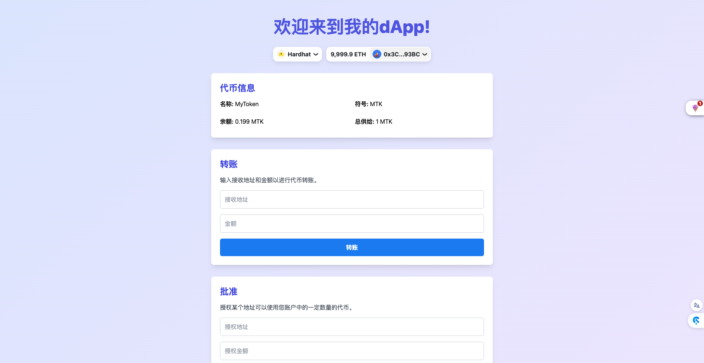

# ERC20 App Demo

这是一个使用 ERC20 协议、Hardhat、RainbowKit 和 PNPM Workspace 构建的去中心化 Demo 应用。



## 项目结构

- `/frontend`: Next.js 前端应用
- `/backend`: Hardhat 智能合约项目

## 开始使用

### 前置要求

- Node.js (推荐版本 18.x 或更高)
- pnpm (如果没有安装,可以运行 `npm install -g pnpm` 进行全局安装)

### 安装依赖

在项目根目录运行：

`pnpm install`

这将为所有子项目安装必要的依赖。

### 配置环境变量

1. 在 `frontend` 目录下创建 `.env` 文件,添加以下内容:

```bash
NEXT_PUBLIC_ENABLE_TESTNETS=true
```

### 启动本地开发环境

1. 启动本地以太坊节点:

在 `backend` 目录下运行:

```bash
pnpm hardhat node
```

2. 部署智能合约:

打开新的终端,在 `backend` 目录下运行:

```bash
pnpm hardhat ignition deploy ./ignition/modules/ERC20.ts --network localhost
```

3. 启动前端开发服务器:

打开新的终端,在 `frontend` 目录下运行:

```bash
pnpm dev
```

4. 在前端项目中设置合约地址和 ABI

在 `frontend/src/contractConfig.ts` 文件中,设置 `ERC20_ADDRESS` 为部署的合约地址,并更新 `erc20Config` 中的 ABI 为部署的合约 ABI。

ABI 可以在 `backend/artifacts/contracts/ERC20.sol/ERC20.json` 文件中找到。

现在,您可以在浏览器中访问 `http://localhost:3000` 来查看您的 dApp。
